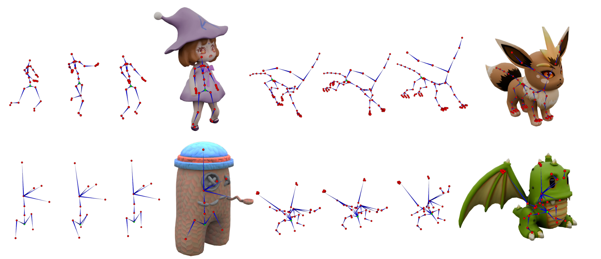

# SkelMo: Universal Skeletal Motion Generation for 3D Rigged Shapes

[Project page](https://research.davytao.me/skelmo/) · [Paper](https://arxiv.org/abs/2606.01518)

Official implementation of **SkelMo: Universal Skeletal Motion Generation for 3D Rigged Shapes**, accepted by ECCV 2026.

**Ye Tao, Yuxin Yao, Kendong Liu, Dapeng Wu, and Junhui Hou**

*City University of Hong Kong*



SkelMo generates category-agnostic skeletal animation for an arbitrary rigged 3D shape from a monocular driving video. It builds on a topology-agnostic diffusion backbone and introduces skinning-aware texture-semantic injection together with bidirectional video-skeleton fusion.

## Release status

- [x] Training and model code
- [x] Inference code for preprocessed inputs
- [x] SkelMo 72k pretrained checkpoint
- [x] Skeleton and rest-pose joint-feature preprocessing
- [ ] Dataset assets and driving-video feature extraction (subject to their respective licenses)

## Installation

The code was developed with Python 3.8, PyTorch 2.4.1, and CUDA 12.1.

```bash
conda env create -f environment.yaml
conda activate skelmo
```

The first run downloads the DINOv2 ViT-B/14 weights through `timm`.

## Repository layout

```text
data_loaders/   SkelMo dataset and collation code
diffusion/      Diffusion process and sampling utilities
model/          Topology-aware SkelMo network
preprocess/     Rest-pose joint-feature preprocessing
sample/         Inference entry points
train/          Distributed training entry points
utils/          Skeleton preprocessing and common utilities
```

## Pretrained checkpoint

Download the [SkelMo 72k checkpoint bundle from Google Drive](https://drive.google.com/file/d/1LaKArVrWRz0vKXAxFlRHwTKhAApOxdEq/view?usp=sharing),
then place the model and its matching configuration in the same directory:

```text
checkpoints/skelmo_final_72k/
├── args.json
└── skelmo_final_72k.pt
```

`args.json` is required because inference restores the model configuration from the checkpoint directory.

SHA-256 checksums:

```text
f790a483fd2b8feaa0b20b73b38a0d5f9c39c5fa0c28f9d93c199fab63d6e76a  skelmo_final_72k.pt
e8a5caed03656f56d9a6ba95357c37514a1798b81c1880d0f39af8e0ce66f00e  args.json
```

## Preparing inference inputs

SkelMo expects a processed target skeleton and DINOv2 features from the driving video.

### Target skeleton

The target asset must have the following layout. `sample.generate` locates the
joint features relative to `cond.npy`, so the two paths must retain this
relationship.

```text
<asset>/
├── joint_averaged_features.npy
└── processed_skeleton/
    └── cond.npy
```

Create `cond.npy` from one or more BVH animations of the target skeleton:

```bash
python -m utils.process_new_skeleton \
  --bvh_dir /path/to/asset/bvhs \
  --save_dir /path/to/asset/processed_skeleton \
  --tpos_bvh /path/to/asset/rest_pose.bvh
```

Using multiple representative BVH files improves the motion normalization
statistics. `--tpos_bvh` is optional; when omitted, the script selects a pose
from the supplied animations. The resulting `cond.npy` stores the joint
hierarchy, rest pose, offsets, graph relations, joint names, and normalization
metadata.

Generate the matching rest-pose joint features from rigged GLB assets:

```bash
python -m preprocess.joint_features.pipeline \
  --input-dir /path/to/rigged_glbs \
  --render-root /path/to/work/renders \
  --output-root /path/to/work/features
```

The pipeline requires Blender 4.x and uses DINOv2 ViT-B/14 to produce the
768-dimensional descriptors expected by the released model. Copy
`<output-root>/<asset>/joint_averaged_features.npy` to `<asset>/`, as shown
above. See the [joint-feature preprocessing guide](preprocess/joint_features/README.md)
for the stage layout, Blender options, output schema, and validation commands.

### Driving-video features

Driving-video features are expected under `<video_dir>/features/`:

```text
<video_dir>/features/
├── timestep_00_view_00_features.npz
├── timestep_01_view_00_features.npz
└── ...
```

Each NPZ file must contain a `features` array with shape `[1, 1370, 768]`: one
CLS token followed by a 37 x 37 DINOv2 ViT-B/14 patch grid. Files are sorted by
the numeric timestep; only the first 40 frames are used. The current repository
does not include the raw-video feature extractor, so these features must be
prepared separately for inference.

## Inference

After preparing a target skeleton and video features, run:

```bash
python -m sample.generate \
  --model_path checkpoints/skelmo_final_72k/skelmo_final_72k.pt \
  --cond_path /path/to/processed_skeleton/cond.npy \
  --video_dir /path/to/driving_video \
  --object_type Target \
  --num_repetitions 1 \
  --output_dir outputs/example
```

The command writes skeletal motion as NumPy, BVH, and MP4 files. An inverse-kinematics refinement projects generated joints back onto the target skeleton to preserve bone lengths.

## Validation

Run the preprocessing unit tests without Blender or model weights:

```bash
python -m unittest discover -s preprocess/joint_features/tests -v
```

## Training

The processed training root follows this layout:

```text
<data_root>/<asset>/
├── joint_max_weight_features.npy
├── imgs_<sequence>/
│   └── timestep_<frame>_view_00.png
└── processed_skeleton/
    ├── cond.npy
    └── global_motions/
        └── *.npy
```

Train on four GPUs with an effective batch size of 16:

```bash
torchrun --standalone --nproc_per_node=4 -m train.train_skelmo \
  --data_dir /path/to/processed_dataset \
  --save_dir save/skelmo \
  --batch_size 4 \
  --num_frames 40 \
  --num_steps 80000 \
  --model_prefix skelmo \
  --overwrite
```

Alternatively, set `SKELMO_DATASET_DIR` instead of passing `--data_dir`.

## Citation

```bibtex
@inproceedings{tao2026skelmo,
  title     = {SkelMo: Universal Skeletal Motion Generation for 3D Rigged Shapes},
  author    = {Tao, Ye and Yao, Yuxin and Liu, Kendong and Wu, Dapeng and Hou, Junhui},
  booktitle = {European Conference on Computer Vision (ECCV)},
  year      = {2026}
}
```

## Acknowledgements

This project builds on [AnyTop](https://anytop2025.github.io/Anytop-page/) and code derived from [Motion Diffusion Model](https://github.com/GuyTevet/motion-diffusion-model), OpenAI guided diffusion, GRPE, and Audiocraft. Visual representations use [DINOv2](https://github.com/facebookresearch/dinov2). Please also follow the licenses of the third-party projects and datasets used with this code.

## License

See [LICENSE](LICENSE). Third-party components and datasets remain subject to their own licenses.
